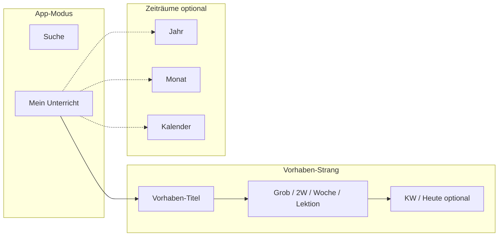

# Navigation — Informationsarchitektur

Stand: Mai 2026. Umsetzung: `PlanningLocationBar`, `SearchLocationBar`.

## Wireframe (Orientierung)

```text
┌─────────────────────────────────────────────────────────────────┐
│  [Lehrplan 21]              Suche  |  Mein Unterricht           │  ← AppTopNav (Modus)
├─────────────────────────────────────────────────────────────────┤
│  Mein Unterricht › Bruchteile › Woche › KW 14 › Mi              │  ← Brotkrumen (immer)
│                                    [ Zeiträume ▾ Jahr·Monat·Kal] │  ← nur bei Bedarf
├─────────────────────────────────────────────────────────────────┤
│  [ Grob ] [ 2 Wochen ] [ Woche* ] [ Lektion ]                   │  ← Ebenen (nur Vorhaben)
├─────────────────────────────────────────────────────────────────┤
│  … Inhalt (eine Hauptaufgabe) …                                 │
└─────────────────────────────────────────────────────────────────┘
```



## Layout-Breite

| Bereich | Token | Verhalten |
|---------|--------|-----------|
| **Suche** | `--app-content-max-width` | bis ca. 58rem (~928px) — gute Lesbarkeit |
| **Planung** | `--planning-page-max` | bis 90rem auf sehr grossen Displays |
| **Jahr / Monat / Kalender** | gleiche `planning-view-panel`-Breite | kein Sprung mehr zwischen Zeiträumen |

Mobile: unter 720px weniger Padding, Kalender-Panel niedriger, Header/Filter gestapelt.

## Fokus-Modi

| Modus | Wann | Zeiträume (Jahr/Monat/Kalender) |
|-------|------|----------------------------------|
| **Überblick** | Hub, Grob, 2 Wochen, Jahr, Monat | sichtbar |
| **Fokus** | Woche, Lektion, Stundenentwurf | eingeklappt unter „Zeiträume“ |

## Suche

```text
Suche › Kette › NT.5.2.a
Suche › Landkarte
```
