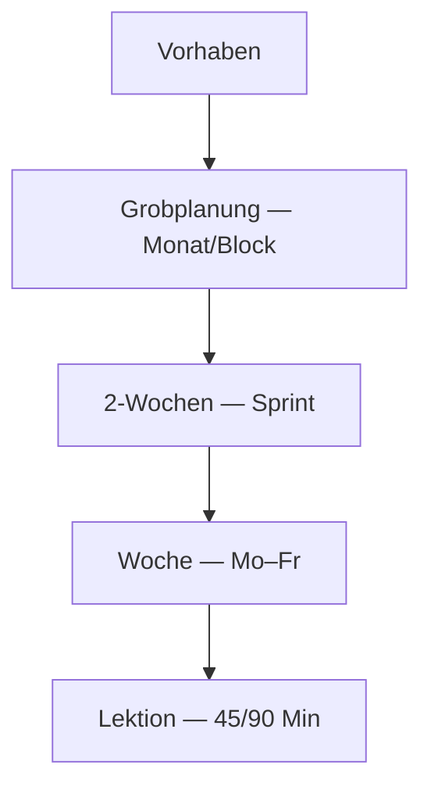

# Planungsvision — Lehrplan_APP

Stand: Mai 2026. Zielgruppe: Lehrpersonen Basel-Stadt (Lehrplan 21).

---

## Das Kernproblem

Im Schulalltag fehlt nicht Information — es fehlt **Struktur und ruhiger Überblick**. Lehrpersonen starten selten mit „einer Kompetenz“, sondern mit:

- einem **Thema** oder **Projekt**
- einem **Kompetenzbereich** (z. B. NT, Deutsch)
- einem **Zeitraum** (Halbjahr, Block, zwei Wochen, diese Woche, diese Lektion)

Sie brauchen dieselbe Sache auf **vier Zoomstufen** bearbeitbar — ohne viermal neu anzufangen.

---

## Bezug: Phasenmodell Unterrichtsplanung (IP FHNW)

Die App-Ebenen orientieren sich am [Phasenmodell Unterrichtsplanung](https://www.fhnw.ch/de/die-fhnw/organisation/lehrpersonen/weiterbildung/digiplan) (klären → entscheiden → gestalten → konkretisieren → sichern → durchführen):

| App-Ebene | FHNW-Phasen | Fokus |
|-----------|-------------|--------|
| Grobplanung | Klären, Entscheiden, Sichern (Plan) | Voraussetzungen, Lernziele, Kompetenzen, Ergebnissicherung |
| 2 Wochen | Gestalten | Material, Medien, Rituale |
| Woche | Konkretisieren | Mo–Fr, Schritte, Differenzierung |
| Lektion | Konkretisieren, Sichern | Ablauf, Zeitblöcke, Sicherung pro Stunde |

**Zirkularität:** Navigation zwischen Ebenen jederzeit — keine erzwungene Reihenfolge.

## Die optimale einfache Lösung: „Ein Vorhaben, vier Ebenen“

### Zentrale Einheit: **Vorhaben** (Arbeitstitel)

Ein Vorhaben bündelt alles zu einem Unterrichtsstrang:

| Feld | Beispiel |
|------|----------|
| Titel | «Bruchteile im Alltag» |
| Fach / Zyklus | Mathematik, Zyklus 2 |
| Kompetenzen | aus Merkliste / Suche (UIDs) |
| Zeitraum | KW 12–17 |
| Notizen | frei |

Darunter **vier Ebenen** — immer dieselbe Vorhaben-ID, unterschiedliche Granularität:

### Was jede Ebene enthält

| Ebene | Inhalt | Baukasten |
|-------|--------|-----------|
| **Grobplanung** | Ziele, grobe Phasen, Schwerpunkte | Vorlagen «Projekt», «Thema», «Kompetenzbereich» |
| **2-Wochen** | Meilensteine, Material, Beobachtungspunkte | Wiederkehrende **Rituale** (Einstieg, Reflexion, Lernstand) |
| **Woche** | Karten pro Tag, **Sondertage**, Erinnerungen | Schul-Kalender (Ferien, Ausflug, Elternabend) |
| **Lektion** | Ablauf, Kompetenzen, Dauer, Material | Verknüpfung zu **Stundenentwurf** (KI-Entwurf später) |

**Prinzip:** Oben geändert → unten als *Vorschlag* anzeigen, nie stumm überschreiben. Unten ergänzt → optional «nach oben spiegeln» (Checkbox).

---

## Baukasten & Zeitgefühl

### Wiederkehrende Rituale (Bibliothek)

Vordefiniert, vom LP anpassbar:

- Morgenkreis / Einstieg (5–10 Min)
- Stationsphase (25 Min)
- Plenum / Reflexion (10 Min)
- Lernstand erfassen
- Hausaufgabe / Mitnahme

Drag auf Woche oder Lektion → **Zeitblock** mit geschätzter Dauer. So entsteht ein **Gespür für Blöcke**, ohne starre Stundenplan-Software.

### Sondertage & Erinnerungen

- **Sondertag-Typen:** Ausflug, Prüfung, Elterninfo, Teamtag, Ersatztag
- **Erinnerungen:** «Material für Mo bestellen», «Elternmail bis Mi»
- Alles **ohne Schülernamen** — nur Klasse/Stufe als Kategorie

### Schuljahr-Raster (leichtgewichtig)

- KW-Nummer, Ferien BS (statisch pflegbar)
- Optionale «leere» Tage in der Wochenansicht

---

## Der Game-Changer: **Bericht → Struktur**

Natürliche Spracheingabe (Text, später evtl. Sprache):

> «Nächste Woche Elternabend Mittwoch, wir müssen in Mathe die Bruchteile abschliessen, Freitag Ausflug Natur, und ich brauche noch Material für die Stationen.»

**Pipeline (konzeptionell):**

1. **Parse** — Intent: Termin, Fach, Kompetenz-Hinweis, To-do, Sondertag
2. **Zuordnen** — aktives Vorhaben + passende Ebene (Woche vs. Lektion vs. Erinnerung)
3. **Vorschlag** — strukturierte Karten zum **Bestätigen** (nicht blind speichern)
4. **Ablage** — bestätigte Teile in localStorage / später Server

| Erkannt | Ablage |
|---------|--------|
| «Elternabend Mittwoch» | Sondertag + Erinnerung |
| «Bruchteile abschliessen» | Wochenziel / offene Kompetenz |
| «Freitag Ausflug» | Sondertag, Lektionen Freitag ausgegraut |
| «Material Stationen» | Erinnerung, optional Lektions-Notiz |

**Datenschutz:** Nur Klassenstufe/Fach/Kompetenztexte — keine Namen von Lernenden in KI-Prompts.

---

## Technische Einordnung (Lehrplan_APP)

| Bereich | Status | Ort |
|---------|--------|-----|
| LP21-Suche, Merkliste, Ketten | ✅ | `App.js`, `competencyBookmarks.js` |
| Stundenentwurf + Kompetenz-Picker | ✅ Phase 1 | `/planung/entwurf`, `CompetencyPicker.js` |
| Vorhaben + 4 Ebenen | 🔜 Phase 2–3 | `planningStore.js`, neue Routen `/planung/vorhaben/:id` |
| NL «Bericht → Struktur» | 🔜 Phase 4 | `POST /api/planning/organize` + Bestätigungs-UI |
| KI Stundenentwurf | 🔜 | `POST /api/planning/lesson-draft` |

Alles in **einem Repo** (GitHub), ein Frontend :3002, ein Backend :5001.

---

## UX-Regeln (damit es einfach bleibt)

1. **Eine Sache pro Screen** — Woche zeigt Woche; Lektion zeigt Lektion; Grobplanung nicht auf derselben Seite wie Minutenplanung.
2. **Immer sichtbar: Wo bin ich?** — `PlanningLocationBar`: Mein Unterricht › Vorhaben › Ebene › KW/Heute (Details: `docs/NAVIGATION_IA.md`).
3. **Merkliste = Kompetenz-Bibliothek** — überall gleich: Suche, Planung, später Vorhaben.
4. **Leer = Baukasten anbieten** — nicht leere Tabellen, sondern «Ritual hinzufügen» / «Vorlage Projekt».
5. **KI schlägt vor, LP entscheidet** — jede Automatik mit Vorschau + Übernehmen.

---

## Phasen-Roadmap (aktualisiert)

| Phase | Inhalt |
|-------|--------|
| **1** ✅ | Stundenentwurf, Kompetenzen aus Merkliste/Suche, Merkliste-UI |
| **2** ✅ | Vorhaben anlegen, Grobplanung + 2-Wochen (`/planung`, localStorage) |
| **3** ✅ | Wochenboard Mo–Fr, Sondertage, Rituale-Bibliothek |
| **4** ✅ | Lektionskarten + Link Stundenentwurf; NL-Organizer (regelbasiert, lokal) |
| **5** 🔜 | KI-Entwurf, optional Export (Text/Markdown) |

---

## Offene Produktfragen

- Vorhaben pro **Klasse** oder fachübergreifend?
- Sync zwischen Geräten (später Login) vs. nur lokal?
- Welche **BS-Ferien/Sondertage** statisch vorkonfigurieren?

*Bei Meilensteinen dieses Dokument und `ZWEIG_LEHRPERSONEN.md` kurz halten.*
