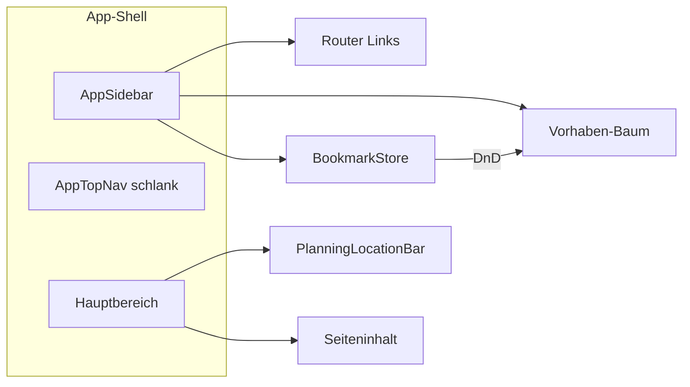

# Globale Seitenleiste — Informationsarchitektur

Stand: Mai 2026. Status: **Phase A–D implementiert** (`frontend/src/shell/`).

Ziel: Eine **persistente linke Navigations- und Organisationsleiste**, die Orientierung, Vorhaben-Struktur und Merkliste **an einem Ort** bündelt — mit Drag & Drop von Kompetenzen in Vorhaben (wie Ordner → Projekt).

---

## Warum eine Seitenleiste?

| Heute | Problem |
|-------|---------|
| `AppTopNav`: nur Suche \| Mein Unterricht | Kein Baum, kein Überblick über Vorhaben |
| Merkliste: FAB + Overlay rechts | Versteckt, getrennt von Vorhaben |
| `PlanningLocationBar`: Brotkrumen | Zeigt Pfad, aber nicht die **Gesamtstruktur** |
| «Ins Vorhaben»: Modal pro Treffer | Viele Klicks, kein Drag |

Die Lehrperson denkt in **Bibliothek** (gesammelte Kompetenzen) und **Vorhaben** (Unterrichtsstränge) — die UI soll dasselbe spiegeln.

---

## Wireframe (Desktop)

```text
┌──────────────┬────────────────────────────────────────────────────────┐
│ LEHRPLAN 21  │  [Brotkrumen: Mein Unterricht › …]          (schmal)   │
├──────────────┼────────────────────────────────────────────────────────┤
│ ORIENTIERUNG │                                                        │
│  ○ Suche     │                                                        │
│  ● Unterricht│              Hauptinhalt                               │
│  ○ Landkarte │                                                        │
├──────────────┤                                                        │
│ ZEIT         │                                                        │
│  Jahr        │                                                        │
│  Monat       │                                                        │
│  Kalender    │                                                        │
├──────────────┤                                                        │
│ VORHABEN  [+]│                                                        │
│  ▼ Bruchteile│  ← aktiv, Drop-Zone                                    │
│    Grob      │                                                        │
│    2 Wochen  │                                                        │
│    Woche     │                                                        │
│    Lektion   │                                                        │
│  ▶ Lesen     │                                                        │
├──────────────┤                                                        │
│ BIBLIOTHEK   │                                                        │
│  ▼ Gemerkt   │                                                        │
│    NT.5.2.a  │  ← draggable                                           │
│    D.3.1.b   │                                                        │
│  ▶ Fach DE   │                                                        │
├──────────────┤                                                        │
│ Heute · KW14 │  ← optional, 1 Zeile Kontext                            │
└──────────────┴────────────────────────────────────────────────────────┘
```

Breite: **280px** offen, **56px** eingeklappt (nur Icons + Badges).

---

## Visuelle Gruppen (maximal nutzbar)

### 1. Orientierung (oben, immer sichtbar)

| Eintrag | Route | Hinweis |
|---------|-------|---------|
| Suche | `/` | LP21-Recherche |
| Mein Unterricht | `/planung` | Hub, «Weiter planen» |
| Landkarte | `/landkarte` | Sekundär, seltener |

**Regel:** Max. 3–4 Einträge — das sind **Modi**, keine Ebenen.

### 2. Zeit (mittig, kompakt)

| Eintrag | Route |
|---------|-------|
| Jahresplan | `/planung/jahr/…` |
| Monatsplan | `/planung/monat/…` |
| Kalender | `/kalender` |

**Regel:** Gleiche Breite/Höhe wie Hauptpanels (`planning-view-panel`) — kein Layout-Sprung (siehe `NAVIGATION_IA.md`).

Aktiver Eintrag = Hintergrund + linker Balken (Bauhaus-Gelb).

### 3. Vorhaben (Kern — Baum)

Jedes Vorhaben = **Ordner** mit 4 **Ebenen** als Kinder:

```text
▼ Bruchteile im Alltag     [3]   ← Badge: offene Meilensteine / Kompetenzen
  · Grob
  · 2 Wochen
  · Woche
  · Lektion
```

- **Klick** auf Titel → letzte besuchte Ebene (`lastVisitedLevel`)
- **Klick** auf Ebene → `vorhabenLevelPath(id, level)`
- **Aktiv** = Route match + gelber Streifen
- **`[+]`** → neues Vorhaben (Vorlage wählen im Hub oder Mini-Dialog)

**Drop-Zone:** Gesamter Vorhaben-Knoten + optional jede Ebene:

| Drop | Wirkung |
|------|---------|
| Kompetenz auf Vorhaben | `addCompetencyToVorhaben` (wie heute «Ins Vorhaben») |
| Kompetenz auf «Lektion» | Kompetenz + optional Navigation zu Lektion |
| (später) Ritual auf «Woche» | wie Ritual-Palette im Panel |

Visuelles Feedback: gestrichelter Rahmen + «Ablegen zum Zuordnen».

### 4. Bibliothek (Merkliste — ersetzt FAB-Drawer)

Bestehende `competencyBookmarks.js`-Ordner **1:1** übernehmen:

- Ordner auf-/zuklappbar (wie heute im Drawer)
- Kompetenz-Zeilen **drag handle** links (HTML5 DnD, bereits in `App.js`)
- Drag **zwischen Ordnern** = bestehende Logik
- Drag **auf Vorhaben** = neue Brücke zu `planningCompetencies`

**Kein zweites «Merkliste»-Konzept** — nur anderer Container (Sidebar statt Overlay).

Optional später: Ordner «Nach Fach» automatisch aus Metadaten.

### 5. Fuss (kollabierbar)

| Eintrag | Nutzen |
|---------|--------|
| Stundenentwurf | `/planung/entwurf` |
| Zuletzt angesehen | 3–5 Kompetenzen (`recentCompetencyHistory`) |
| Einklappen | Sidebar auf Icon-Leiste |

---

## Einbindung in die bestehende UI



| Komponente | Rolle nach Einführung |
|------------|----------------------|
| `AppTopNav` | Nur Brand + ggf. Sidebar-Toggle auf Mobile |
| `PlanningLocationBar` | Bleibt: **Wo genau** in der gewählten Ebene (KW, Heute) |
| Merkliste-FAB | **Entfällt** auf Desktop, wenn Bibliothek in Sidebar |
| `AddToVorhabenControl` | Bleibt als **Fallback** in Suchresultaten (+ Quick-Add) |

**Prinzip:** Sidebar = **Struktur & Sammlung**, Brotkrumen = **Kontext**, Inhalt = **Arbeit**.

---

## Responsive Verhalten

| Viewport | Verhalten |
|----------|-----------|
| **≥ 1280px** | Sidebar fix links, Inhalt `margin-left: 280px` |
| **1024–1279px** | Standard eingeklappt (56px), Hover/Click expandiert |
| **&lt; 1024px** | Sidebar als **Overlay** (Hamburger), FAB Merkliste optional bis Phase 2 |
| **&lt; 720px** | Unten: 2 Tabs «Inhalt» \| «Bibliothek» ODER Vollbild-Overlay — Kalender braucht Breite |

Auf Mobile **keine** permanente 280px-Leiste — sonst unbenutzbarer Kalender.

---

## Drag & Drop — technische Anknüpfung

Bereits vorhanden:

- HTML5 DnD in Merkliste (`App.js`: `bookmark-drag-handle`, Ordner-Drop)
- `@fullcalendar/interaction` Draggable für Kalender
- `addCompetencyToVorhaben` in `planningCompetencies.js`

Neu (Phase 2):

```text
dataTransfer: { type: 'lp21-competency', uid, code, label, fach }
```

Drop handler auf `.app-sidebar-vorhaben-drop`:

1. `preventDefault` + visuelles `drag-over`
2. `addCompetencyToVorhaben(vorhaben, entry)`
3. Toast: «NT.5.2.a → Bruchteile»
4. Optional: `navigate(vorhabenLevelPath(id, 'grob'))`

Kein neues npm-Paket nötig für MVP (native DnD). `@dnd-kit` nur wenn Multi-Liste + Touch-Probleme.

---

## Datenmodell (kurz)

| Quelle | Speicher | Sidebar-Sektion |
|--------|----------|-----------------|
| `planningStore.vorhaben` | `lp21-planning-v1` | Vorhaben-Baum |
| `bookmarkStore.folders` | `lp21-competency-bookmarks-v2` | Bibliothek |
| Router | — | Aktive Markierung |
| `lastActiveVorhabenId` | planning store | Vorhaben oben sortieren / hervorheben |

**Bewusst nicht:** Merkliste-Ordner ≠ Vorhaben (Ordner = Sammlung, Vorhaben = Unterrichtsplanung). Verknüpfung nur per **Zuordnung** (Drag oder Quick-Add).

---

## Implementierungsphasen

| Phase | Inhalt | Nutzen |
|-------|--------|--------|
| **A** | `AppShell` + Sidebar-Gruppen 1–2 (Nav + Zeit), Router-Sync | Navigation ohne FAB-Chaos |
| **B** | Vorhaben-Baum, Klick → Routen, `[+]` | Überblick + 1-Klick-Ebenen |
| **C** | Bibliothek aus Drawer in Sidebar, Ordner-DnD | Merkliste immer sichtbar (Desktop) |
| **D** | DnD Kompetenz → Vorhaben | Kern-Mehrwert «wie Ordner» |
| **E** | Mobile Overlay + Badges/Heute-Fuss | Vollständig nutzbar |

Geschätzter Ort im Code: `frontend/src/shell/AppSidebar.js`, `AppShellLayout.js`, Einbindung in `AppRouter.js`.

---

## UX-Regeln (damit es nicht überladet)

1. **Max. 5 sichtbare Gruppen** — mit `details`/Akkordeon pro Gruppe
2. **Vorhaben-Baum**: standardmässig nur **aktives** + **zuletzt 2** aufgeklappt
3. **Bibliothek**: max. 8 sichtbare Items pro Ordner, Rest «+ N weitere»
4. **Keine Metadaten** in der Zeile (nur Code + 1 Zeile Label)
5. **DnD ist Zusatz** — jeder Drop hat Äquivalent per Klick (Kontextmenü «Zu Vorhaben …»)

---

## Offene Produktfragen

- Merkliste-Ordner später **pro Vorhaben** spiegeln (Auto-Ordner) oder getrennt lassen?
- Vorhaben **pro Klasse** gruppieren (Ordner «Klasse 5b») — ja/nein?
- Sidebar auf **Suche** standardmässig eingeklappt (mehr Platz für Ergebnisse)?

*Bei Start Phase A: dieses Dokument + `NAVIGATION_IA.md` abgleichen.*
